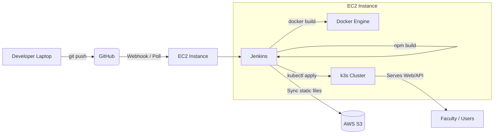

# System Architecture

## System Context Diagram

## Data Flow

1. **Code Commit**: Developer pushes code to the GitHub repository.
2. **CI Trigger**: Jenkins (running on EC2) polls GitHub or receives a webhook, triggering the pipeline.
3. **Build**: Jenkins runs `npm run build` to compile the React application.
4. **Artifact Archival**: The build artifacts (static files) are synced to AWS S3. This provides a versioned archive and backup.
5. **Containerization**: Jenkins builds Docker images for the frontend (Nginx serving static files) and the status API.
6. **Deployment**: Jenkins imports the images into k3s and applies the Kubernetes manifests to update the application in the cluster.
7. **Serving**: k3s (via Ingress) serves the application to end-users (faculty/demo viewers).

## Component Table

| Component | What it does | Why not alternatives? |
| :--- | :--- | :--- |
| **AWS EC2** | Single node hosting Jenkins, Docker, and k3s. | Cost-effective for dev/demo. Avoids overhead of managing separate servers. |
| **AWS S3** | Stores versioned build artifacts. | Keeps a permanent history of successful builds independently of the compute instance, allowing rollback even if Jenkins/Docker fail. |
| **Docker** | Containerizes the frontend (Nginx + CRA) and small status API. | Ensures consistency between Jenkins build environment and k3s runtime. |
| **Jenkins** | Sole CI/CD engine automating build, archive, and deployment. | Explicit project requirement to replace GitHub Actions. Consolidates CI/CD on the existing EC2 instance. |
| **k3s** | Lightweight Kubernetes distribution for orchestrating containers. | Runs comfortably on a single EC2 instance. We are avoiding EKS due to high cost and limited AWS credits. |

## Environments

Currently, the system is designed to deploy to a single **"staging"** namespace on the k3s cluster. This aligns with the dev/demo nature of the project.

## Security Notes

*   **SSH**: Access to the EC2 instance is restricted to SSH using a secure key pair.
*   **IAM Policy**: The EC2 instance should have an IAM role attached that grants minimal necessary permissions, primarily `s3:PutObject` and `s3:ListBucket` for the `sakshyam-portfolio-artifacts` bucket.
*   **Secrets**: No AWS credentials or sensitive secrets are stored in Git. All required configuration is injected via Jenkins environment variables or securely stored on the EC2 instance.
